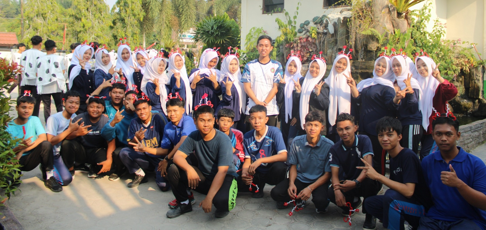

<!DOCTYPE html>
<html lang="id">
<head>
  <meta charset="UTF-8">
  <meta name="viewport" content="width=device-width, initial-scale=1.0">
  <title>Website Kelas X-7 - SMAN 1 Pangkalan Lada</title>
  <!-- Google Fonts & Font Awesome -->
  <link href="https://fonts.googleapis.com/css2?family=Plus+Jakarta+Sans:wght@400;500;600;700&display=swap" rel="stylesheet">
  <link rel="stylesheet" href="https://cdnjs.cloudflare.com/ajax/libs/font-awesome/6.4.0/css/all.min.css">
  
</head>
<body>
  <!-- Header -->
  <header>
    
    

    

      <h1>SMAN 1 Pangkalan Lada</h1>
      <h2>Informasi Kelas X-7</h2>
      
Memuat waktu...

    

  </header>
  <!-- Navigasi Menu Grid 3x3 yang Rapi di HP -->
  

    <button class="menu-btn" onclick="showContent('beranda')"><i class="fa-solid fa-house"></i> Beranda</button>
    <button class="menu-btn" onclick="showContent('struktur')"><i class="fa-solid fa-sitemap"></i> Struktur</button>
    <button class="menu-btn" onclick="showContent('anggota')"><i class="fa-solid fa-users"></i> Anggota</button>
    <button class="menu-btn" onclick="showContent('pelajaran')"><i class="fa-solid fa-calendar-days"></i> Jadwal</button>
    <button class="menu-btn" onclick="showContent('piket')"><i class="fa-solid fa-broom"></i> Piket</button>
    <button class="menu-btn" onclick="showContent('pr')"><i class="fa-solid fa-book"></i> Tugas</button>
    <button class="menu-btn" onclick="showContent('galeri')"><i class="fa-solid fa-images"></i> Galeri</button>
    <a href="https://aku-sehat.vercel.app/" target="_blank" class="menu-btn"><i class="fa-solid fa-list-check"></i> Jurnal</a>
    <button class="menu-btn" onclick="showContent('pesan')"><i class="fa-solid fa-envelope"></i> Pesan</button>
  

  <!-- Konten Utama -->
  <main>
    

      <h2>Selamat Datang di Website Kelas X-7!</h2>
      
Website resmi kelas X-7 untuk mempermudah koordinasi, melihat jadwal, serta berbagai informasi penting lainnya secara cepat dan rapi.

    

  </main>
  <!-- Footer -->
  <footer>
    
Hak Cipta &copy; 2026 Kelas X-7 | SMAN 1 Pangkalan Lada

    

      <a href="https://www.instagram.com" target="_blank"><i class="fab fa-instagram"></i> Instagram</a>
      <a href="https://www.tiktok.com" target="_blank"><i class="fab fa-tiktok"></i> TikTok</a>
    

  </footer>
  <!-- Script -->
  
</body>
</html>
